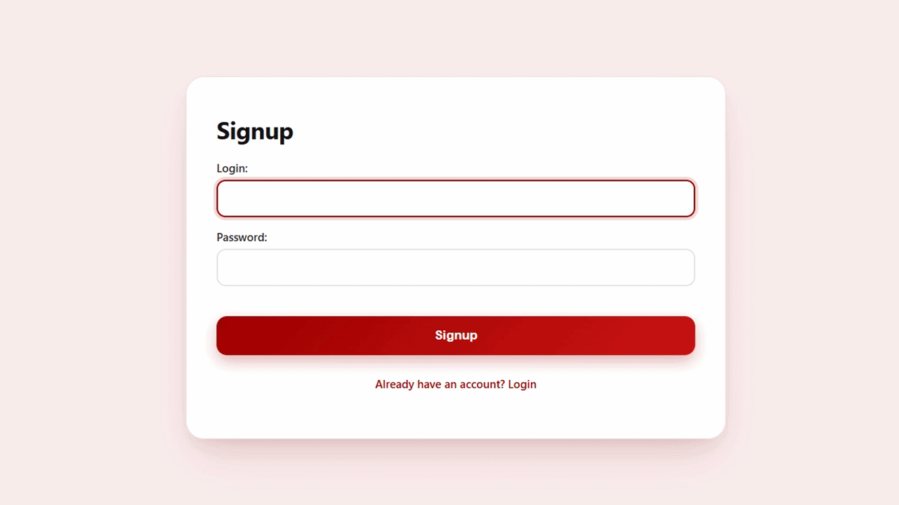
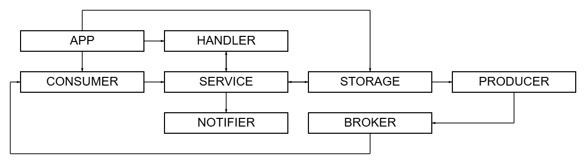

<h3 align="center">Production-grade delayed notification service using RabbitMQ message queues, Redis caching, and robust retry logic for guaranteed delivery.</h3>

## 



<br>

## Table of Contents

- [Architecture](#architecture)
- [Installation](#installation)
- [Configuration](#configuration)
- [Shutting down](#shutting-down)
- [API](#api)
- [Validation](#validation)
- [Error mapping and error codes](#error-mapping-and-error-codes)
- [Broker behavior](#broker-behavior)
- [Status values](#status-values)
- [Request examples](#request-examples)

<br>

## Architecture

- **App** — the central orchestrator of the system.  
  Responsible for application bootstrap and lifecycle management. It loads configuration, initializes all core components (storage, cache, broker, service, sysmon), wires their dependencies together, and controls startup and graceful shutdown using a shared context.

- **Broker** — the messaging layer responsible for delayed delivery and message flow control.  
  It publishes notifications to per-notification delay queues in RabbitMQ, configured with TTL and dead-lettering into the main queue. The broker manages producers and consumers, monitors broker health, handles retries with backoff, and cooperates with recovery logic to ensure messages are not lost during outages.

- **Sysmon** — a background supervisor and maintenance loop.  
  Periodically performs database cleanup according to retention policies, monitors broker and database health, marks late notifications when delivery deadlines are missed, and triggers recovery when the broker transitions from an unhealthy to a healthy state.

- **Service** — the application-level business logic layer.  
  Validates incoming requests, enforces notification state transitions, coordinates interactions between cache, storage, and broker, and exposes a clean API to the HTTP layer. This is where domain rules live.

- **Cache** — auxiliary in-memory layer used to reduce database load (Redis).  
  Stores notification statuses and frequently accessed metadata to reduce database load and provide low-latency reads. Cache failures are non-fatal: the system transparently falls back to storage when needed.

- **Storage** — the persistent data layer and source of truth (PostgreSQL).  
  Stores notifications, recipients, statuses, and timestamps. Implements transactional updates, recovery queries and cleanup logic based on retention rules. All critical state transitions ultimately pass through storage.

- **Notifier** — the delivery adapter layer for outbound notifications.    
  Responsible for delivering notifications to external channels. Encapsulates all channel-specific protocols, credentials, and transport logic behind a unified interface.



<br>

## Installation
⚠️ Note: This project requires Docker Compose, regardless of how you choose to run it.  

First, clone the repository and enter the project folder:

```bash
git clone https://github.com/Pur1st2EpicONE/Chronos.git
cd Chronos
```

Then you have two options:

#### 1. Run everything in containers
```bash
make
```

This will start the entire project fully containerized using Docker Compose.

#### 2. Run Chronos locally
```bash
make local
```
In this mode, only PostgreSQL, RabbitMQ and Redis are started in containers via Docker Compose, while the application itself runs locally.

⚠️ Note:
Local mode requires Go 1.25.1 and the latest version of the migrate CLI tool installed on your machine.

<br>

## Configuration

### Runtime configuration

Chronos uses two configuration files, depending on the selected run mode:

[config.full.yaml](./configs/config.full.yaml) — used for the fully containerized setup

[config.dev.yaml](./configs/config.dev.yaml) — used for local development

You may optionally review and adjust the corresponding configuration file to match your preferences. The default values are suitable for most use cases.

### Environment variables and notification credentials

By default, Chronos runs without any external notification credentials. In this mode, delivery attempts to channels that require authentication (Telegram, Email) will fail, and notifications are effectively limited to stdout output. If you want to enable additional notification channels, you must provide the corresponding credentials via environment variables.

Chronos uses a .env file for runtime configuration. You may create your own .env file manually before running the service, or edit [.env.example](.env.example) and let it be copied automatically on startup.
If environment file does not exist, .env.example is copied to create it. If environment file already exists, it is used as-is and will not be overwritten.

⚠️ Note: Keep .env.example for local runs. Some Makefile commands rely on it and may break if it's missing.

<br>

## Shutting down

Stopping Chronos depends on how it was started:

- Local setup — press Ctrl+C to send SIGINT to the application. The service will gracefully close connections and finish any in-progress operations.  
- Full Docker setup — containers run by Docker Compose will be stopped automatically.

In both cases, to stop all services and clean up containers, run:

```bash
make down
```

⚠️ Note: In the full Docker setup, the log folder is created by the container as root and will not be removed automatically. To delete it manually, run:
```bash
sudo rm -rf <log-folder>
```

⚠️ Note: Docker Compose also creates a persistent volume for PostgreSQL data (chronos_postgres_data). This volume is not removed automatically when containers are stopped. To remove it and fully reset the environment, run:
```bash
make reset
```

<br>

## API

All endpoints are mounted under /api/v1. Responses follow a simple wrapper convention:

- Success: **200 OK** with JSON body **{"result": \<value>}**
- Error: appropriate status code with JSON body **{"error": "\<message>"}**

<br>

### Create notification 

```bash
POST /api/v1/notify 
```

Request body example:
```json
{
  "channel": "email",
  "subject": "email subject",
  "message": "optional notification text",
  "send_at": "2026-01-10T02:21:00+02:00",
  "send_to": ["recipient1@example.com", "recipient2@example.com"]
}
```

**channel** (string, required) Channel to deliver the notification.

**subject** (string, required for email, not used for other channels) Email subject.

**message** (string) Notification body.

**send_at** (string, required) Scheduled send time in RFC3339 format. 

**send_to** (array of strings, required for email) One or more notification recipients.

<br>

On success, the API returns 200 OK and notification id. Example:

```json
{
  "result": "123e4567-e89b-12d3-a456-426614174000"
}
```

Typical error responses

- **400 Bad Request** — invalid JSON, missing fields, invalid send_at format, validation failures (see [Validation](#Validation)).
- **500 Internal Server Error** — urgent broker failure (see [Broker behavior](#Broker-behavior)) or other internal failures.

<br>

### Get notification status

```bash
GET /api/v1/notify?id=<notification_id>
```

Query parameter: **id** (string, required) — notification UUID.


On success, the API returns 200 OK and notification status (see [Status values](#Status-values)). Example:
```json
{
  "result": "pending"
}
```

Error codes:

**400 Bad Request** — invalid UUID format.

**404 Not Found** — notification not found.

**500 Internal Server Error** — internal error while fetching status.

<br>

### Cancel notification

```bash
DELETE /api/v1/notify?id=<notification_id>
```

Attempts to cancel a notification. Cancellation logic is implemented so that a single DB query determines if a cancel is possible (to avoid a prior read); cache is used to optimize common cases.

Query parameter: **id** (string, required) — notification UUID.

On success, the API returns 200 OK and notification status "canceled" (see [Status values](#Status-values)). Example:
```json
{
  "result": "canceled"
}
```

Error codes:

**400 Bad Request** — invalid UUID format or cancellation not allowed (e.g., already sent).

**404 Not Found** — notification not found.

**500 Internal Server Error** — internal failure when updating status.

<br>

## Validation

The **channel** field must be present. It supports values such as telegram, email, or stdout, and these are case-insensitive. If an unknown channel is provided, the service returns **ErrUnsupportedChannel** (see [Error mapping](#Error-mapping-and-error-codes)).

For the **message** field, the maximum length is enforced through **[MaxMessageLength](https://github.com/Pur1st2EpicONE/Chronos/blob/21e1b36271f2e2f954388e34d3d1f9ec5e2f3d99/internal/models/models.go#L40)**. If the length exceeds this constant, it results in **ErrMessageTooLong**. If the message is empty, the server saves a placeholder character ("ㅤ" — U+3164 Hangul Filler) to ensure compatibility with channels like Telegram that do not allow empty bodies.

The **send_at** field must be provided. It needs to parse correctly as RFC3339 format, with examples of valid values including "2026-01-09T02:14:00Z" or "2026-01-09T04:14:00+02:00". If parsing fails, the service returns **ErrInvalidSendAt**. Additionally, the send_at time must not be in the past, which would trigger **ErrSendAtInPast**, and it must not be too far in the future—specifically, no greater than one year from now—or it will return **ErrSendAtTooFar**.

When the **channel** is set to email, additional validations apply. The **send_to** field must be non-empty, or it will return **ErrMissingSendTo**. The **subject** must be present, triggering **ErrMissingEmailSubject** if missing. The subject length is limited by **[MaxSubjectLength](https://github.com/Pur1st2EpicONE/Chronos/blob/21e1b36271f2e2f954388e34d3d1f9ec5e2f3d99/internal/models/models.go#L39)**, and exceeding this leads to **ErrEmailSubjectTooLong**. Each recipient in send_to must be a valid email address, otherwise **ErrInvalidEmailFormat** is returned. Finally, each recipient's length is capped by **[MaxEmailLength](https://github.com/Pur1st2EpicONE/Chronos/blob/21e1b36271f2e2f954388e34d3d1f9ec5e2f3d99/internal/models/models.go#L38)**, resulting in **ErrRecipientTooLong** if exceeded.

⚠️ Note: Some numeric limits, such as **MaxMessageLength**, are defined in the codebase; refer to **[internal/models](internal/models/models.go)** for the concrete values.

<br>

## Error mapping and error codes

The API maps internal errors to HTTP statuses.

### 400 Bad Request

This status is returned for validation and client errors. Examples include:

- **ErrInvalidJSON**: "invalid JSON format"
- **ErrInvalidNotificationID**: "missing or invalid notification ID"
- **ErrMissingChannel**: "channel is required"
- **ErrUnsupportedChannel**: "unsupported channel"
- **ErrMessageTooLong**: "message exceeds maximum length"
- **ErrMissingSendAt**: "send_at is required"
- **ErrInvalidSendAt**: "invalid send_at format, expected RFC3339"
- **ErrSendAtInPast**: "send_at cannot be in the past"
- **ErrSendAtTooFar**: "send_at is too far in the future"
- **ErrMissingSendTo**: "send_to is required"
- **ErrMissingEmailSubject**: "email subject is required"
- **ErrEmailSubjectTooLong**: "email subject is too long"
- **ErrInvalidEmailFormat**: "invalid email format"
- **ErrCannotCancel**: "notification cannot be canceled in its current state"
- **ErrAlreadyCanceled**: "notification is already canceled"
- **ErrRecipientTooLong**: "recipient exceeds maximum length"

<br>

The error body for these cases follows the format:
```json
{ "error": "<error message>" }
```

where the message corresponds to the specific error string.

### 404 Not Found

This status is returned when a notification cannot be located:

- **ErrNotificationNotFound**: "notification with given ID not found"

### 500 Internal Server Error

This status handles more severe issues, including:

- **ErrUrgentDeliveryFailed**: "cannot schedule notification for immediate delivery — service is temporarily unavailable" (explicitly triggered when the broker fails for urgent notifications)
- Other unhandled or internal errors, mapped to a generic **ErrInternal** message: "internal server error"


<br>

## Broker behavior

After a successful validation and DB insert, the service attempts to enqueue the notification to the broker. If the broker is unavailable and the notification's send time is within the **[brokerRecoveryWindow](https://github.com/Pur1st2EpicONE/Chronos/blob/21e1b36271f2e2f954388e34d3d1f9ec5e2f3d99/internal/service/impl/create_notification.go#L12)**, the service attempts to delete the notification from storage and returns **ErrUrgentDeliveryFailed**, which maps to a 500 Internal Server Error.

If the broker produce fails but the notification is not within **brokerRecoveryWindow** (that is, scheduled later than 1 hour from now), the service does not return an error. Instead, the code logs the broker failure but continues, meaning the notification remains in storage and the caller receives a success response with the created ID, even though the broker enqueue temporarily failed.

The broker runs a system monitoring task, sysmon, which periodically performs cleanup, health checks, and recovery. It checks the health of the broker client at intervals defined by **[HealthcheckInterval](https://github.com/Pur1st2EpicONE/Chronos/blob/21e1b36271f2e2f954388e34d3d1f9ec5e2f3d99/configs/config.full.yaml#L55)**
. If the broker is unhealthy, it marks notifications that are past their scheduled send time by updating their status from pending to late (also known as running late) and updates the cache accordingly. When the broker recovers and becomes healthy again, it triggers recovery to re-queue pending and late notifications.

The recover function retrieves notifications with statuses pending or late from storage, ordered by send_at and limited by **[RecoverLimit](https://github.com/Pur1st2EpicONE/Chronos/blob/21e1b36271f2e2f954388e34d3d1f9ec5e2f3d99/configs/config.full.yaml#L38)**, then re-queues them by calling Produce on each.

Implication: Callers that depend on immediate enqueue reliability for near-term notifications must handle the possibility of **ErrUrgentDeliveryFailed**. For notifications scheduled further in the future, enqueue retries or broker reconciliation processes (such as recovery during sysmon) should handle eventual enqueue.

<br>

## Status values

**pending** — Notification is created but not yet sent.

**canceled** — Notification has been canceled.

**sent** — Notification was successfully sent.

**failed to send** — Notification failed to send due to error. This happens if something goes wrong on the side of the external API, for example, if the Telegram bot token is incorrect and the Telegram API responds with an error.

**running late** — Notification delayed past its scheduled send time. This status is set automatically by the broker's sysmon process when it detects that the broker is down. During the health check, sysmon updates notifications that have passed their send_at from pending to running late.

**failed to send in time** — Notification failed to send before scheduled time. This occurs when, at the moment the sending should have happened, the broker was down, so the consumer did not read the message and did not send it on time. Later, when the broker recovers, the consumer sends the notification as soon as possible, but already with a clear delay.

<br>

## Request examples

⚠️ Note: When the service is running, a web-based UI is available at http://localhost:8080. The examples below demonstrate how to interact with the API directly using curl.

### Create Notification (stdout)

```bash
curl -X POST http://localhost:8080/api/v1/notify \
  -H "Content-Type: application/json" \
  -d '{
    "channel": "stdout",
    "send_at": "2026-01-09T05:51:00+02:00"
  }'
```

### Response

```json
{
  "result": "40e9f0d7-ec78-45f8-9961-8a1728ec9d6f"
}
```

<br>

### Create Notification (telegram)

```bash
curl -X POST http://localhost:8080/api/v1/notify \
  -H "Content-Type: application/json" \
  -d '{
    "channel": "telegram",
    "message": "Hello from Chronos!",
    "send_at": "2026-01-09T05:40:00+02:00"
  }'
```

### Response

```json
{
  "result": "4b0c9d28-f30c-4503-ad3c-430a82b40dd3"
}
```

<br>

### Create Notification (email)

```bash
curl -X POST http://localhost:8080/api/v1/notify \
  -H "Content-Type: application/json" \
  -d '{
    "channel": "email",
    "subject": "Email example",
    "message": "Hello from Chronos!",
    "send_to": ["example1@gmail.com", "example2@gmail.com"],
    "send_at": "2026-01-09T05:39:00+02:00"
  }'
```

### Response

```json
{
  "result": "54c61eb2-1e54-4863-a76e-caffc85284fd"
}
```

<br>

### Cancel Notification (stdout)

```bash
curl -X DELETE "http://localhost:8080/api/v1/notify?id=40e9f0d7-ec78-45f8-9961-8a1728ec9d6f"
```

### Response

```json
{
  "result": "canceled"
}
```

<br>

### Get Notification Status (email)

```bash
curl "http://localhost:8080/api/v1/notify?id=54c61eb2-1e54-4863-a76e-caffc85284fd"
```

Response:

```json
{
  "result": "sent"
}
```

<br>

### Get Notification Status (telegram)

```bash
curl "http://localhost:8080/api/v1/notify?id=4b0c9d28-f30c-4503-ad3c-430a82b40dd3"
```

Response:

```json
{
  "result": "pending"
}
```

<br>

### Get Notification Status (stdout)

```bash
curl "http://localhost:8080/api/v1/notify?id=40e9f0d7-ec78-45f8-9961-8a1728ec9d6f"
```

Response:

```json
{
  "result": "canceled"
}
```
